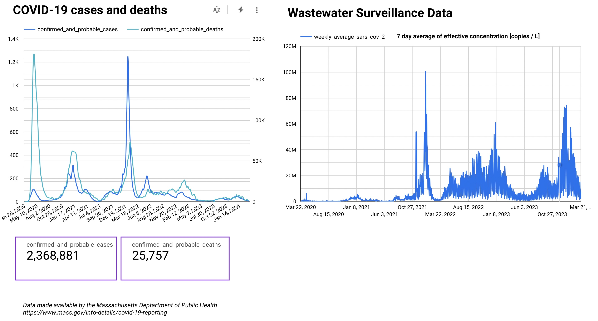

## Summary
Determine if there’s a correlation between COVID-19 case data & wastewater surveillance data  in Massachusetts, USA

## Problem Description 
The Massachusetts Department of Public Health collects data on COVID-19 cases and deaths for the whole state. In addition, wastewater surveillance data is collected for SARS-CoV-2, which is an indicator of COVID-19 in a community. Massachusetts collects this data from more than 30 Wastewater Treatment plants throughout the state.  Wastewater surveillance data is valuable in that it shows the amount of virus in the community and can provide an early warning of rising cases. **This project aims to show if there’s a correlation between the two data sets in one dashboard.** While the majority of this data is historical and COVID-19 cases are low, this data is still being collected and reported on, with updates made available weekly. This type of analysis could also be used for future viruses.  

## Solution
The solution uses [Mage](https://www.mage.ai/) as an orchestrator to facilitate the **batch** data pipeline:
- [Mage is running in the cloud](http://34.98.67.178/pipelines) on Google Cloud Run as a service, using Terraform for the deployment. A nightly trigger is configured to run the entire pipeline. 
- COVID-19 case and wastewater datasets (xls format) are accessed via API from [mass.gov](https://www.mass.gov/) and then exported to [Google Cloud Storage](https://console.cloud.google.com/storage/browser/de-cohort2024-project-coviddata).
- This data is then retrieved from Google Cloud Storage (GCS), transformation is done to standardize the column names, and then the data is exported to [Google BigQuery](https://console.cloud.google.com/bigquery?ws=!1m4!1m3!3m2!1slinear-archway-412518!2scovid_data).
- Dbt Cloud is used to create fact tables from BigQuery that can be used in reporting. Mage calls the [dbt model build job](https://cloud.getdbt.com/deploy/244343/projects/363710/jobs) as the last step in the orchestration.
- A dashboard is built in [Google Looker Studio](https://lookerstudio.google.com/s/ud7jFkov2Nk) to show the MA COVID-19 case and wastewater data comparison based on the fact tables. 

## Code Structure
- The majority of the work is done in Mage, that code resides in the /mage folder. This could be run locally via a Docker container or in a Mage cloud as is currently deployed. I used Data Loader blocks to access the mass.gov COVID-19 data and retrieve data from GCS, Data Exporter blocks to export that data to GCS and BigQuery, and Transformer blocks to make adjustments to the data frame field names. Finally, I used a Custom block with the Mage DbtCloudClient library to call Dbt model run job that I had built in the Dbt Cloud IDE. I developed the pipeline locally and had some issues when I deployed to the cloud version; I had to manually move the files into the cloud version unfortunately. 
- The dbt model code resides in the /dbt folder. The code was developed in the Dbt Cloud IDE and is stored in GitHub via the integration that dbt provides. I used dbt to stage the data and then create fact tables that are used in the Google Looker Studio dashboard. 

## Findings
The dashboard shows a strong collection between the overall trends in wastewater data as it relates to COVID-19 cases, particularly around the end of 2021/beginning of 2022. Some discrepancies in the data can be easily explained: 
- At the beginning of the COVID-19 pandemic, wastewater testing was not in wide use so not a lot of data is available in 2020.
- Later in pandemic, the existence of virus can be seen in the wastewater data indicating that COVID-19 is still present but many people don't test &/or test at home so the case data is not captured.

## Resources
The data is available from [MA COVID-19 reporting](https://www.mass.gov/info-details/covid-19-reporting) and [MA Wastewater Surveillance Reporting](https://www.mass.gov/info-details/wastewater-surveillance-reporting).

